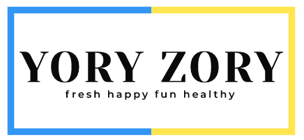
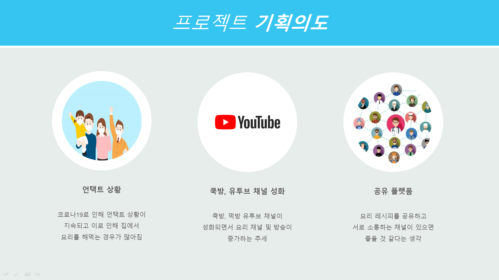
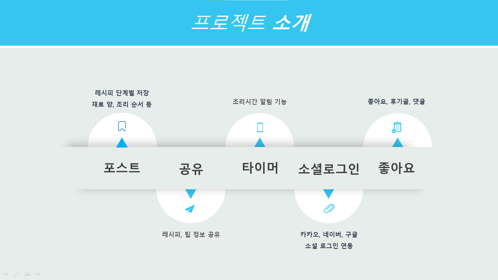
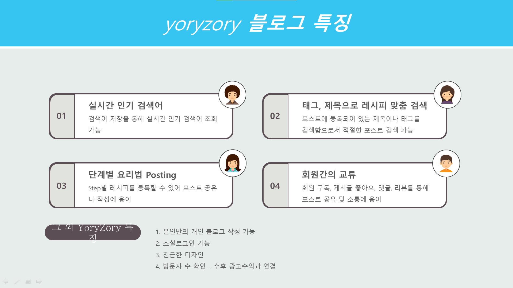
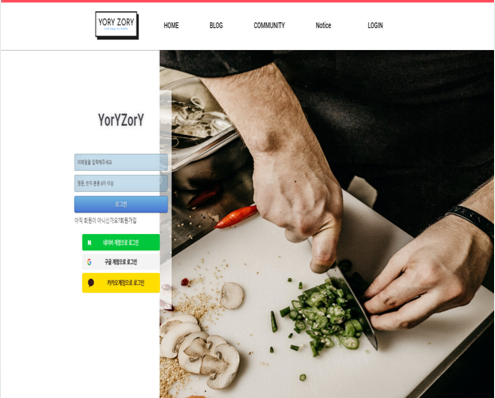
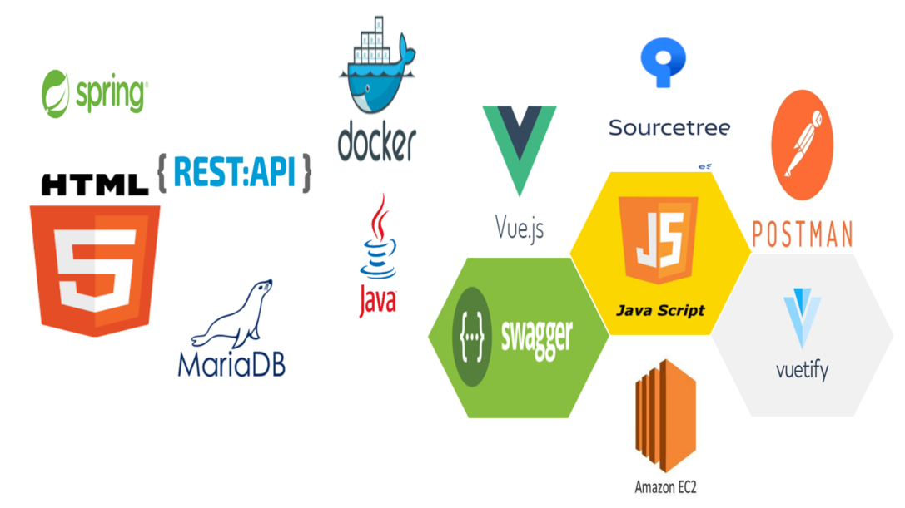
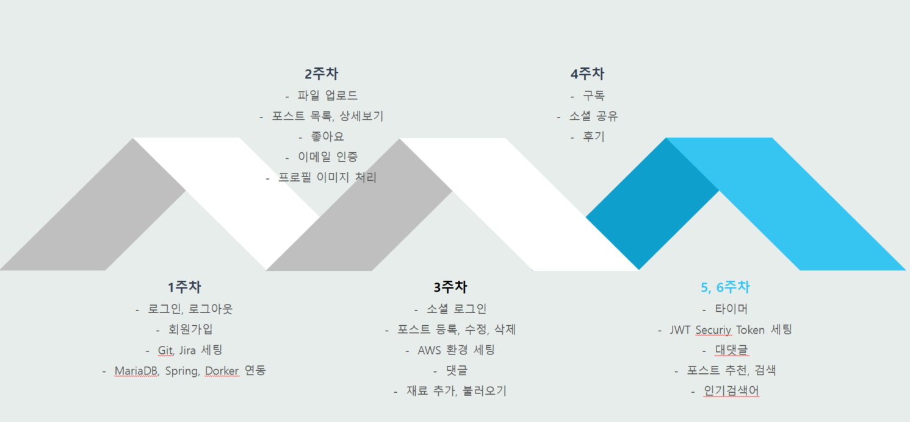

<center>
    
</center>


> YORYZORY / 요리조리 (ssafy 3rd 공통프로젝트)


### 🏠 [Github](https://github.com/titiman1013/YORYZORY) (*코드 미공개) :clapper:[Demo 시연영상](https://youtu.be/I1R6Cu8MLyc) :microphone:[Presentation](https://docs.google.com/presentation/d/1R6fd37cnxLNXQxbF2IXRIyQbmCHOlhdplsCh_0-tVuA/edit?usp=sharing)

 

## :memo: Description

```sh
냉장고에... 계란🥚이 있네
근데 매일 똑같은 계란후라이🍳🐣지겨우신적 있으시죠?
새로운 레시피 편하게 공유해요!
우리들의 새로운 레시피 공유 사이트 YORYZORY
```


## :pushpin: Project Goal

#### Intension
<center>
    <br>
</center>

#### Introduce
<center>
    <br>
</center>


## 📃 블로그 특징

<center>
    <br>
</center>


## 🔍 Overview

#### 1. 로그인 / 회원가입 페이지 (Login / Sign up Page)

<center>
    <br>
</center>

<center>
    <br>
</center>


#### 2. 마이페이지 (My Page)

<center>
    <br>
</center>

<center>
    <br>
</center>

<center>
    <br>
</center>


#### 3. 메인 페이지 (Main Page)

<center>
    <br>
</center>


#### 4. 게시글 페이지 (Post Page)

<center>
    <br>
</center>


#### 5. 포스트 등록 페이지 (Posting Page)

<center>
    <br>
</center>


## 🔧 Tech Stack

#### Tech Stack

<center>
    <br>
</center>

#### System Architecture

<center>
    <br>
</center>


## 🏃‍♂️ 개발 과정

<center>
    <br>
</center>


## 🤼‍♂️ Author

Team Leader : 🐼 __Kim Dukgi__

Backend : 🦊 __Nam Yoonjung__

Backend : 🐭 __Nam Hyemin__

Backend : 🐷 __Lee Hyunsuk__

Frontend : 🦁 __Roh Hyunsuk__

Frontend : 🐰 __Choi Hojin__


## 📝 License

Copyright © 2020 YORYZORY
